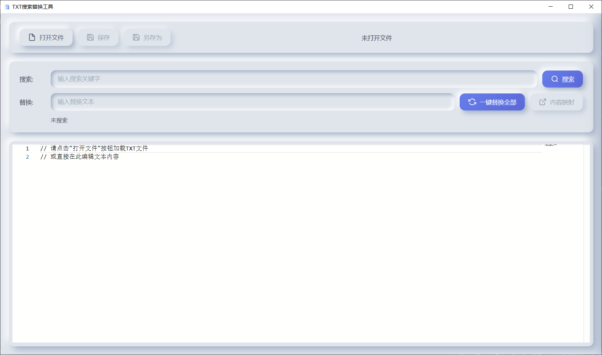
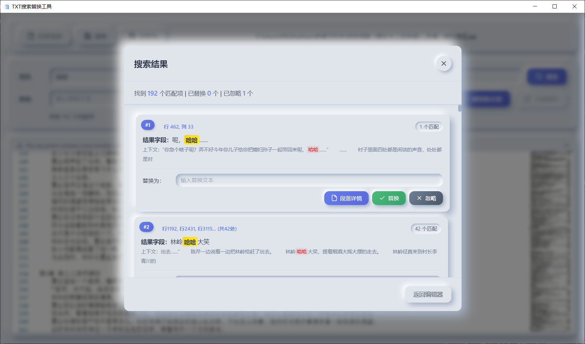
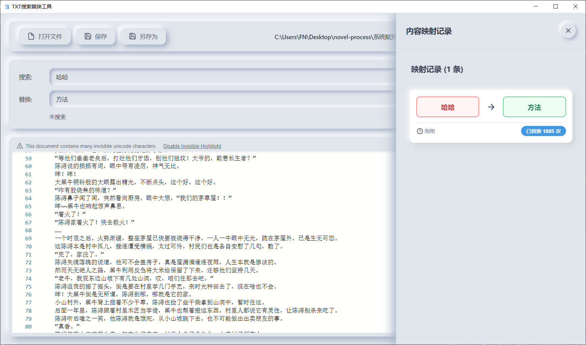

# TXT 搜索替换工具

<div align="center">
  
  
  <p>一个优雅、高效的 TXT 文件搜索替换桌面应用</p>
  
  [](LICENSE)
  [](https://www.electronjs.org/)
  [](https://microsoft.github.io/monaco-editor/)
</div>

---

## 📖 简介

**TXT 搜索替换工具**是一款基于 Electron 开发的桌面应用，专为批量文本搜索和替换场景设计。它集成了微软的 Monaco Editor（VS Code 的核心编辑器），提供专业级的代码编辑体验，同时支持多线程搜索、智能分组、映射历史记录等高级功能。

无论是处理大型日志文件、批量修改配置文件，还是进行文本数据清洗，这款工具都能让你事半功倍！

---

## ✨ 核心功能

### 🔍 智能搜索
- **多线程搜索**：根据文件大小自动选择单线程或多线程（2-8 线程），极速处理大文件
- **实时进度显示**：搜索过程中实时显示进度和已找到的匹配数量
- **可中断搜索**：支持随时停止搜索操作
- **上下文预览**：显示每个匹配项的前后文内容，精准定位

### 🔄 强大的替换功能
- **一键替换全部**：快速将所有匹配项批量替换
- **逐项确认替换**：在搜索结果弹窗中逐条查看、确认、替换或忽略
- **结果字段分组**：自动按前后文字符分组，相同上下文的匹配项合并处理
- **虚拟列表渲染**：大数据量搜索结果（超过 200 条）采用队列渲染，流畅不卡顿

### 📝 专业编辑体验
- **Monaco Editor**：集成 VS Code 的核心编辑器，支持语法高亮、行号、代码折叠等
- **智能自动布局**：编辑器自适应窗口大小
- **自动保存提示**：修改后实时启用保存按钮
- **快捷键支持**：`Ctrl+S` 保存、`Ctrl+F` 搜索、`Esc` 关闭弹窗

### 🎯 特色功能
- **内容映射记录**：自动记录搜索和替换的历史（最多 20 条），支持快速填充
- **段落详情查看**：点击"段落详情"按钮查看当前段落、上下段落的完整内容
- **映射记录侧边栏**：美观的侧边栏展示所有历史映射，点击即可填充
- **拟态化 UI 设计**：现代化的拟物风格界面，视觉舒适

### 📊 操作统计
- 实时显示匹配数量、已替换数量、已忽略数量
- 队列渲染时显示待渲染项数量
- 替换历史记录显示操作时间和次数

---

## 🚀 快速开始

### 环境要求
- Node.js 16.x 或更高版本
- npm 或 yarn 包管理器
- Windows / macOS / Linux 操作系统

### 安装步骤

1. **克隆项目**
   ```bash
   git clone https://github.com/LittleOrange-i/TXT_Search.git
   cd TXT_Search
   ```

2. **安装依赖**
   ```bash
   npm install
   ```

3. **启动应用**
   ```bash
   npm start
   ```

4. **打包应用**（可选）
   ```bash
   npm run build
   ```
   打包后的文件会生成在 `dist` 目录中。

---

## 📸 功能演示

### 主界面

*Monaco Editor 编辑器 + 搜索替换面板*

### 搜索结果

*分组展示搜索结果，支持逐项操作*

### 映射记录

*历史映射记录侧边栏，一键快速填充*

### 段落详情

*查看当前段落及上下文*

---

## 🎯 使用指南

### 基本操作流程

1. **打开文件**
   - 点击"打开文件"按钮，选择 TXT 文件
   - 文件内容会自动加载到编辑器中

2. **搜索关键字**
   - 在"搜索"输入框输入关键字
   - 点击"搜索"按钮或按 `Enter`
   - 等待搜索完成（大文件会显示进度）

3. **查看和处理结果**
   - 搜索完成后弹出结果窗口
   - 每条结果显示位置、上下文、匹配数量
   - 可以：
     - 点击结果跳转到编辑器对应位置
     - 输入替换文本并点击"替换"
     - 点击"忽略"跳过该项
     - 点击"段落详情"查看完整段落

4. **一键替换全部**（推荐）
   - 在"替换"输入框输入替换文本
   - 点击"一键替换全部"按钮
   - 确认后自动完成所有替换

5. **查看映射历史**
   - 点击"内容映射"按钮
   - 查看所有历史映射记录
   - 点击任意记录可自动填充到输入框

6. **保存文件**
   - 点击"保存"按钮保存到原文件
   - 点击"另存为"选择新位置保存
   - 或使用快捷键 `Ctrl+S`

---

## 🛠️ 技术栈

| 技术 | 说明 |
|------|------|
| **Electron** | 跨平台桌面应用框架，负责主进程和窗口管理 |
| **Monaco Editor** | 微软开源的代码编辑器 |
| **Web Workers** | 多线程搜索，不阻塞 UI 渲染 |
| **拟态化设计** | 现代化 UI 风格，柔和的光影效果 |
| **原生 JavaScript** | 纯前端实现，无第三方框架依赖（除编辑器） |

---

## 📂 项目结构

```
TXT_Search/
├── assets/              # 静态资源（图标）
│   ├── icon.png
│   └── icon.ico
├── node_modules/        # 依赖包
├── main.js              # Electron 主进程入口
├── renderer.js          # 渲染进程逻辑（UI 交互）
├── preload-renderer.js  # 预加载脚本（IPC 通信）
├── search-worker.js     # Web Worker 搜索线程
├── index.html           # 主窗口 HTML
├── styles.css           # 样式表
├── package.json         # 项目配置
└── README.md            # 项目文档
```

---

## ⚙️ 配置说明

### 多线程搜索策略

根据文件大小自动选择线程数：
- `< 100KB`：单线程（避免 Worker 开销）
- `100KB - 1MB`：2 线程
- `1MB - 5MB`：4 线程
- `> 5MB`：8 线程

### 虚拟列表渲染

搜索结果超过 **200 条**时自动启用队列渲染：
- 初次渲染前 200 条
- 替换或忽略后自动从队列补充新项
- 避免大量 DOM 导致卡顿

### 历史记录限制

- 最多保存 **20 条**映射记录
- 按时间倒序排列
- 自动合并相同的搜索-替换对

---

## ⌨️ 快捷键

| 快捷键 | 功能 |
|--------|------|
| `Ctrl + S` | 保存文件 |
| `Ctrl + F` | 聚焦搜索框 |
| `Enter` | 在搜索框按下执行搜索 |
| `Esc` | 关闭所有弹窗和侧边栏 |

---

## 🐛 常见问题

### 1. 搜索速度慢？
- **原因**：文件过大（超过 10MB）或关键字匹配项过多
- **解决方案**：工具会自动启用多线程搜索，请耐心等待；也可以点击"停止搜索"

### 2. 搜索结果弹窗卡顿？
- **原因**：匹配项超过 200 条时会启用队列渲染
- **解决方案**：已自动优化，每次只渲染可见项，替换或忽略后自动补充

### 3. 无法输入搜索框？
- **原因**：极少数情况下焦点被编辑器占用
- **解决方案**：点击搜索框即可恢复；工具已优化此问题

### 4. 打包后图标不显示？
- **原因**：`assets/icon.ico` 路径不正确
- **解决方案**：确保 `assets` 文件夹包含在打包配置中

---

## 🤝 贡献指南

欢迎提交 Issue 和 Pull Request！


## 📄 许可证

本项目基于 [MIT License](LICENSE) 开源。

---

## 💬 联系方式

如有问题或建议，欢迎通过以下方式联系：

- **Issues**：[GitHub Issues](https://github.com/LittleOrange-i/TXT_Search/issues)
- **Email** LittleOrange-i@qq.com

---

## 🌟 致谢

- [Electron](https://www.electronjs.org/) - 强大的桌面应用框架
- [Monaco Editor](https://microsoft.github.io/monaco-editor/) - 专业的代码编辑器
- 所有贡献者和使用者

---

<div align="center">
  <p>如果这个项目对你有帮助，请给一个 ⭐ Star 支持一下！</p>
</div>
